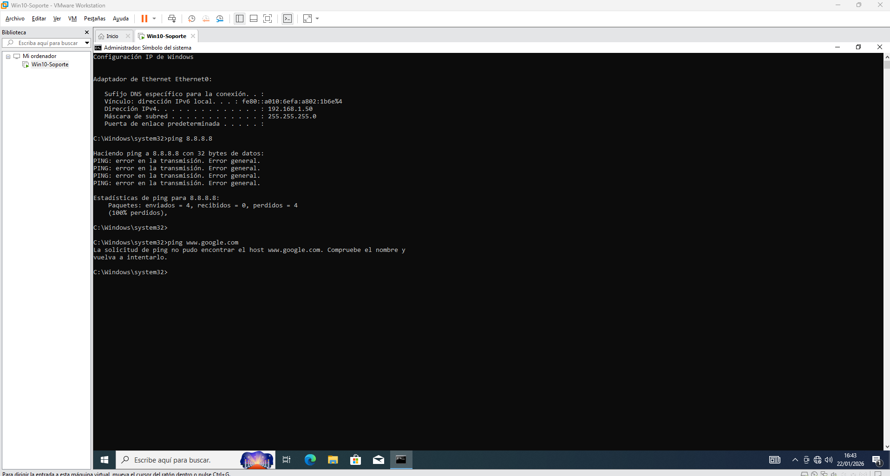
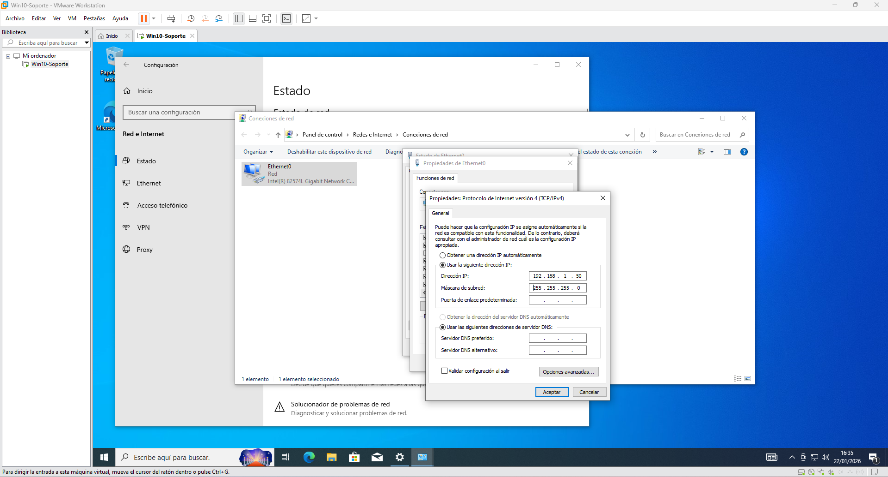
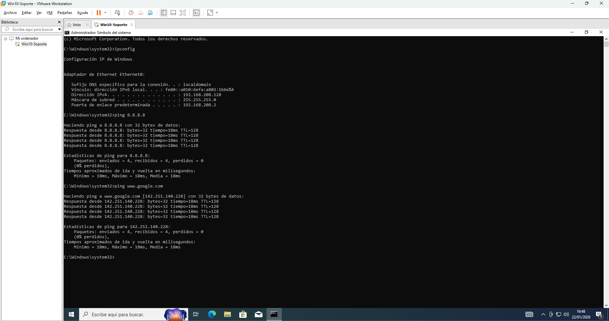

# Incidencia: Equipo sin conexión a Internet

## 1. Descripción de la incidencia

El usuario contacta con soporte indicando que su ordenador con Windows no se conecta a Internet.  
El problema se presenta de forma continua y le impide navegar o acceder a servicios que requieren conexión a la red.

La incidencia afecta al normal funcionamiento del puesto de trabajo, por lo que se procede a su revisión para identificar la causa del problema.

## 2. Entorno y diagnóstico inicial

El equipo afectado es un ordenador con sistema operativo Windows, utilizado como puesto de trabajo en un entorno corporativo.  
El usuario indica que no tiene conexión a Internet, tanto por cable como por Wi-Fi, y que el problema persiste tras reiniciar el equipo.

Antes de realizar cambios en la configuración, se procede a un diagnóstico inicial para identificar si el origen del problema es físico, de red o de configuración del sistema.

### Comprobaciones iniciales realizadas

- Se verifica que el cable de red esté correctamente conectado y en buen estado.
- Se comprueba si el equipo detecta redes Wi-Fi disponibles.
- Se revisa el estado del adaptador de red desde el sistema operativo.
- Se confirma que el problema no afecta a otros equipos de la misma red.

Tras estas comprobaciones, se continúa con el análisis desde el propio sistema operativo para identificar la causa del fallo de conectividad.

### Diagnóstico de conectividad desde consola

{.glightbox}

*Comprobación inicial mediante **ipconfig** y **ping**, sin respuesta a IP externa ni resolución DNS.*

#### Estado inicial del equipo

Se comprueba la configuración de red desde línea de comandos para verificar si el equipo dispone de dirección IP y conectividad.

Al realizar pruebas de conectividad hacia una IP externa, no se obtiene respuesta.

## 3. Identificación de la causa

Se revisa la configuración del adaptador de red y se detecta que la dirección IPv4 está configurada de forma manual, sin puerta de enlace ni servidores DNS definidos, lo que impide la salida a Internet.

### Configuración incorrecta IPv4

{.glightbox}

*Configuración manual incorrecta de IPv4 sin puerta de enlace ni servidores DNS configurados.*

## 4. Solución aplicada

Se modifica la configuración del adaptador de red para obtener la dirección IP y los servidores DNS de forma automática mediante DHCP.

### Corrección de configuración IPv4

{.glightbox}

*Se establece la obtención automática de dirección IP mediante DHCP.*

{.glightbox}

*Configuración de servidores DNS automáticos para restaurar la resolución de nombres.*

## 5. Verificación y resultado final

Tras aplicar los cambios, el equipo obtiene conectividad correctamente.  
Se realizan pruebas de conectividad a direcciones IP externas y a nombres de dominio, confirmando la resolución del problema.

### Verificación y resultado final

{.glightbox}

*Respuesta correcta a IP externa y resolución DNS funcional.*

