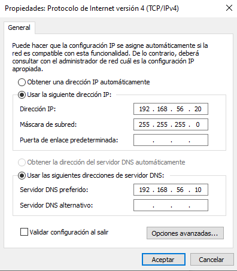
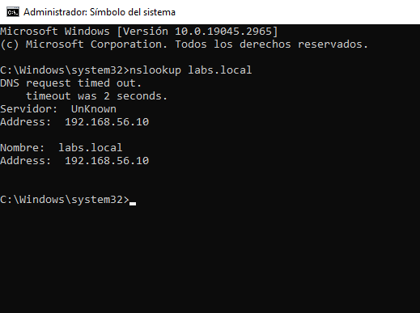
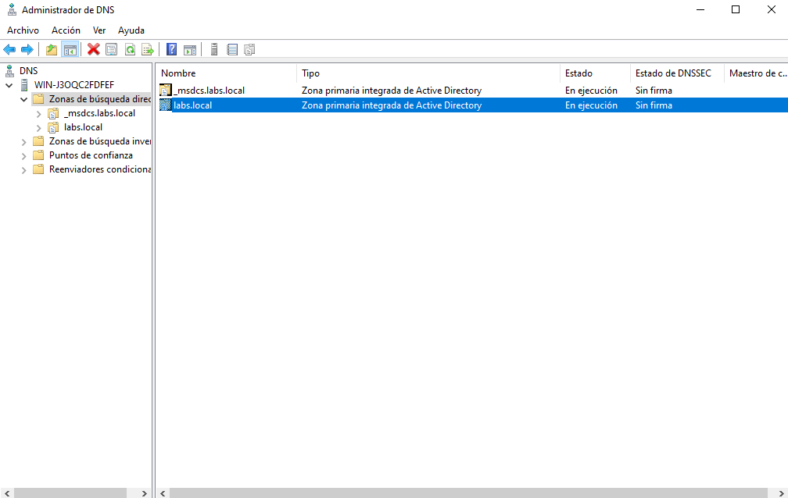
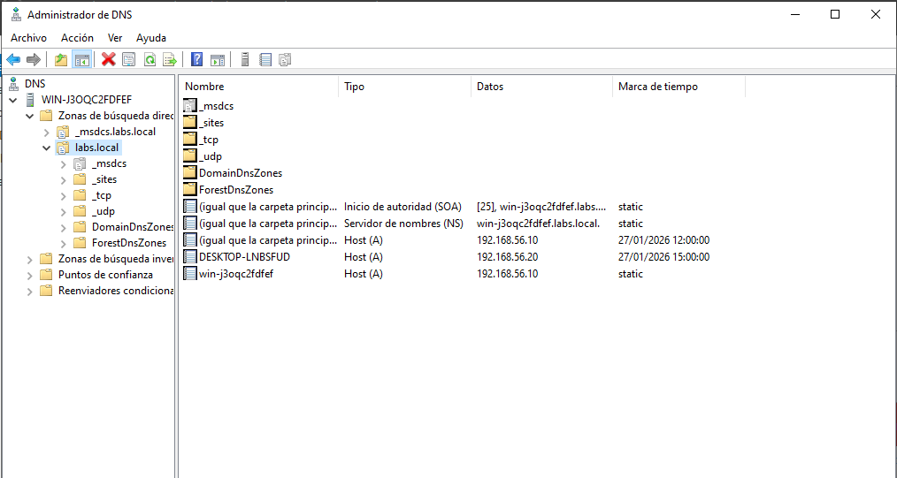
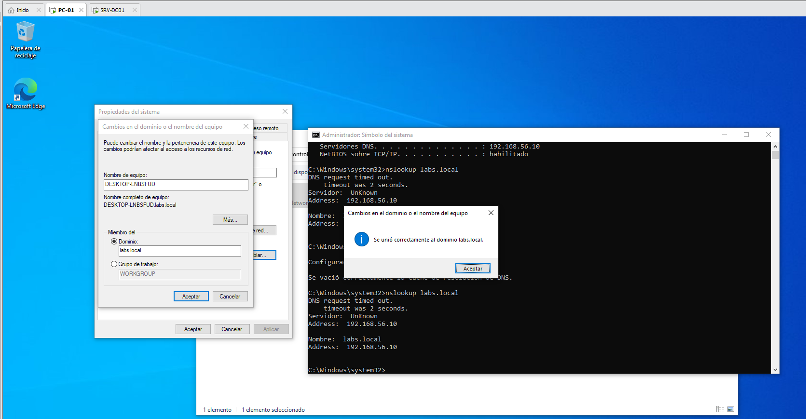
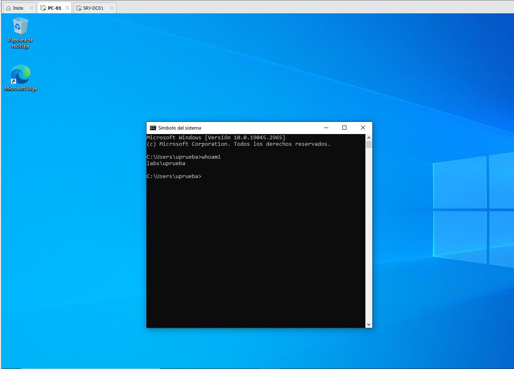
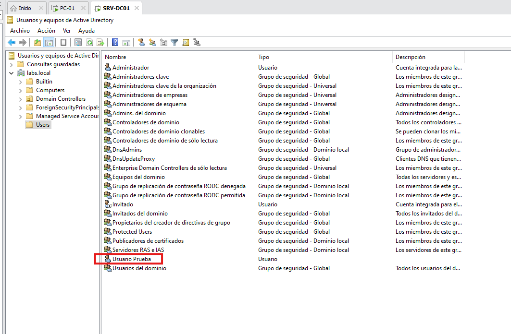

# LAB 02 – Usuario no puede iniciar sesión en el dominio

## Descripción del problema
Un usuario del dominio no puede iniciar sesión en un equipo cliente unido al dominio `labs.local`.

## Entorno
- Hypervisor: VMware Workstation
Servidor:
  - Windows Server 2022
  - Rol AD DS y DNS
  - Nombre: SRV-DC01
  - IP: 192.168.56.10
Cliente:
  - Windows 10
  - Nombre: PC-01
  - IP: 192.168.56.20
- Dominio: labs.local

## Síntomas
- El equipo cliente no puede iniciar sesión con un usuario del dominio.
- Mensajes de error al intentar unir o autenticar en el dominio.
- Resolución DNS inconsistente.

## Diagnóstico

Se realizaron las siguientes comprobaciones:

- Conectividad de red entre cliente y servidor
- Configuración IP del cliente
- Servidor DNS configurado correctamente
- Estado del servicio DNS
- Existencia del usuario en Active Directory
- Resolución de registros SRV del dominio

## Resolución

Se corrigieron los siguientes puntos:

- Configuración del servidor DNS en el cliente
- Uso de credenciales correctas del administrador del dominio
- Unión correcta del equipo cliente al dominio `labs.local`
- Inicio de sesión exitoso con un usuario del dominio

- Inicio de sesión exitoso con un usuario del dominio.

## Verificación
- El equipo cliente aparece en Active Directory.
- El usuario puede iniciar sesión correctamente.

- Resolución DNS correcta desde cliente y servidor.

## Conclusión
Una configuración incorrecta de DNS o el uso de credenciales erróneas puede impedir la autenticación en dominios Active Directory. Verificar DNS y cuentas administrativas es clave en incidencias de este tipo.
